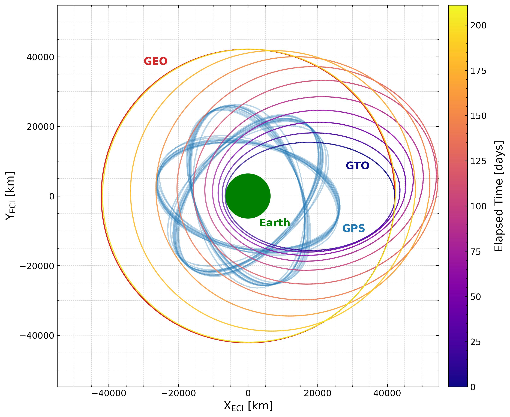
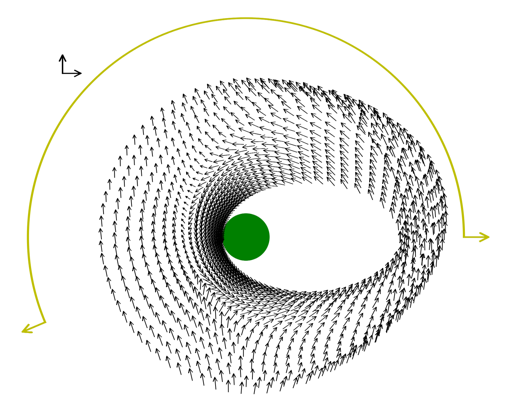
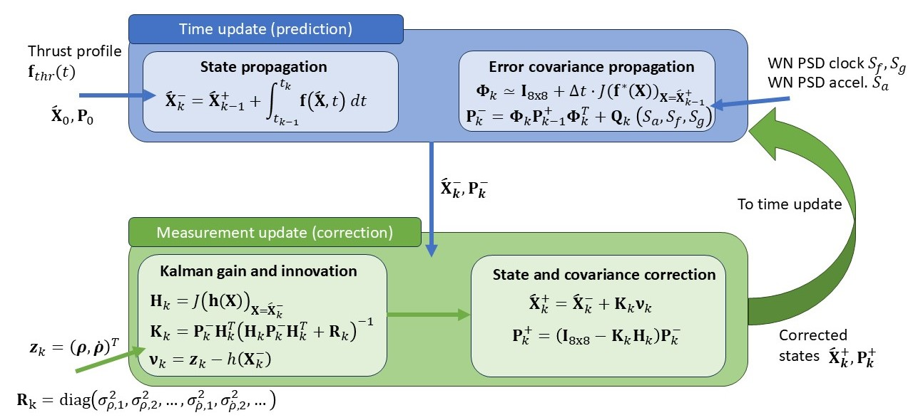
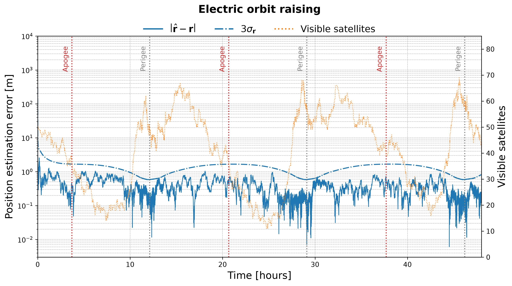

<a name="readme-top"></a>

<h3 align="center">GNSS-Based Orbit Determination Framework</h3>

  <p align="center">
    A high-fidelity Python framework for autonomous spacecraft navigation and orbit determination using an Extended Kalman Filter (EKF), simulated multi-GNSS observables, and complex environmental dynamics.
    <br />
    <a href="https://github.com/Justo1999/GNSS_Orbit_Determination"><strong>Explore the docs »</strong></a>
    <br />
    <br />
    <a href="https://github.com/Justo1999/GNSS_Orbit_Determination/issues/new?labels=bug&template=bug-report---.md">Report Bug</a>
    ·
    <a href="https://github.com/Justo1999/GNSS_Orbit_Determination/issues/new?labels=enhancement&template=feature-request---.md">Request Feature</a>
  </p>
</div>

<details>
  <summary>Table of Contents</summary>
  <ol>
    <li>
      <a href="#about-the-project">About The Project</a>
      <ul>
        <li><a href="#built-with">Built With</a></li>
      </ul>
    </li>
    <li>
      <a href="#getting-started">Getting Started</a>
      <ul>
        <li><a href="#prerequisites">Prerequisites</a></li>
        <li><a href="#installation">Installation</a></li>
      </ul>
    </li>
    <li><a href="#usage">Usage</a></li>
    <li><a href="#roadmap">Roadmap</a></li>
    <li><a href="#contributing">Contributing</a></li>
    <li><a href="#license">License</a></li>
    <li><a href="#contact">Contact</a></li>
    <li><a href="#acknowledgments">Acknowledgments</a></li>
  </ol>
</details>

## About The Project

This repository provides a scientific-grade framework designed to estimate a satellite's kinematic orbital state. This framework was originally envisioned to study the feasibility of performing GNSS-based orbit determination in an electric orbit raising scenario to GEO orbit. Nevertheless, it serves as an excellent sandbox to get started with GNSS-based spacecraft navigation, as it is user-friendly, can be used for both single-constellation and multi-constellation receiver architectures, and it is modular and highly extensible.

**Key Mathematical & Physical Models:**
* **Autonomous orbit determination:** An Extended Kalman Filter that continuously estimates the position and velocity of the spacecraft, integrating GNSS measurements with a dynamical model of the system.
* **Dynamical model:** Includes the acceleration due to the geopotential up to an arbitrary order and degree N (EGM2008 spherical harmonics), third-body perturbations (Sun/Moon), solar radiation pressure (SRP) with eclipse tracking, and the effect of thrust.
* **Measurement Simulation:** Generates realistic pseudorange and pseudorange-rate GNSS measurements.

You can find more information in the associated publication https://www.researchgate.net/publication/408309288_GNSS-Based_Orbit_Determination_for_GEO_Satellites_During_Electric_Orbit_Raising

<p align="right">(<a href="#readme-top">back to top</a>)</p>

### Built With

<p align="left">
  <a href="https://www.python.org/">
    
  </a>
  <a href="https://numpy.org/">
    
  </a>
  <a href="https://scipy.org/">
    
  </a>
  <a href="https://jupyter.org/">
    
  </a>
</p>

_Additional core astrodynamics libraries include Astropy, PySHTools, and SGP4._

<p align="right">(<a href="#readme-top">back to top</a>)</p>

## Getting Started

To ensure full compatibility with the specific scientific libraries, it is highly recommended to manage the installation via Conda.

### Prerequisites

Ensure you have Anaconda or Miniconda installed on your system.
* [Download Anaconda](https://www.anaconda.com/download)

### Installation

1. Clone the repo
   ```sh
   git clone https://github.com/Justo1999/GNSS_Orbit_Determination.git
   cd GNSS_Orbit_Determination
   ```

2. Create a fresh Conda environment
   ```sh
   conda create -n orbit_env python=3.11
   conda activate orbit_env
   ```

3. Install pip and the required dependencies
   ```sh
   conda install pip
   pip install -r requirements.txt
   ```

4. Install the orbit determination framework module
    ```sh
   pip install -e . 
   ```

### Usage

The project execution is handled entirely through high-level Jupyter Notebooks, keeping the core source code clean and modular. Some sample files have been included in order to demonstrate the code usage. As this framework was originally developed to be used in the case of a satellite undergoing an electric orbit raising (EOR), the sample files contained in `data/raw/receiver_orbits/eor/` for the reference user trajectory correspond to two different scenarios during the EOR. The files contain the kinematic state of the satellite (cartesian representation and classical orbital elements), the thrust vector orientation in the inertial frame, and the satellite's attitude in the Roll-Pitch-Yaw representation. The `obt_ignition.txt` file was also included, containing the ignition times of the thrusters as a function of the onboard time. **You may of course use your own data for the user reference orbit, attitude, and thrust profile**. However, take into account that if you change the data structure, you'll also have to adjust the data import lines in the notebooks accordingly.

**Satellite trajectory during the electric orbit raising (left), and thrust orientation (right). Both plots show equatorial projections.**
<p align="center">
  
  
</p>


1. **Constellation Generation & SGP4 Propagation**
   Open `notebooks/01_gnss_orbit_sim.ipynb`. This notebook parses Orbital Mean Elements (OMMs), filters non-operational satellites, and propagates the trajectories of the GNSS constellations using the SGP4 algorithm. The ephemeris data is transformed from TEME to the GCRF frame and exported as `.npz` files. Sample OMM files have been included.

2. **Visibility Analysis**
   Open `notebooks/02_gnss_visibility.ipynb`. This notebook's purpose is to determine the visible navigation satellites for each GNSS constellation, and export the data to `data/processed/visibility/`. The user's reference trajectory is imported from `data/raw/receiver_orbits/`. In the notebook, you should specify the receiver antenna orientation in the body frame, maximum receiver and transmitter off-boresight angles, as well as the minimum carrier-to-noise ratio required for signal acquisition. Reference curves for the receiver antenna gain and EIRP patterns for the GNSS constellations can be found in the directory `data/raw/antennas/`. 

3. **Receiver Clock Simulation**
   Open `notebooks/03_clock_sim.ipynb`. This notebook generates the stochastic "true" clock bias and drift for the receiver over the course of the simulation. It utilizes a 2-state random walk model based on the Allan variance parameters of the clock. The default values used correspond to a standard OCXO clock, but you should adjust them to your specific clock architecture.

4. **Run the Filter Simulation**
   Open `notebooks/04_kalman_filter_run.ipynb`. This notebook initializes the physical environment, loads the reference user trajectory and the GNSS visibility data from the `data/` directory, interpolates GNSS constellations orbital data to the measurement times, and executes the EKF. Here, you can adjust the acceleration white noise power spectral density $S_a$, and the GNSS measurement frequency. Output state arrays are automatically exported to `data/processed/filter_results/`. 

**EKF high-level architecture**
<p align="center">

</p>

5. **Analyze the Results**
   Open `notebooks/05_kalman_filter_plots.ipynb`. This notebook ingests the .npy arrays generated by the filter and creates some simple plots, comparing the estimated state against the true trajectory alongside $\pm 3\sigma$ uncertainty bounds and Mahalanobis consistency checks. 

**Position estimation error obtained with the EKF (sample)**
<p align="center">

 </p>


### Contributing

If you have a suggestion that would make this better, please fork the repo and create a pull request. You can also simply open an issue with the tag "enhancement". 
   
Don't forget to give the project a star! Thanks again!

1. Fork the Project

2. Create your Feature Branch (git checkout -b feature/CoolFeature)

3. Commit your Changes (git commit -m 'Add some CoolFeature')

4. Push to the Branch (git push origin feature/CoolFeature)

5. Open a Pull Request


### License

Distributed under the MIT License. See `LICENSE` for more information.

### Contact

* Justo Fanelli - justo.j.fanelli@gmail.com - [LinkedIn Profile](https://www.linkedin.com/in/justo-fanelli/)
* Project Link: https://github.com/Justo1999/GNSS_Orbit_Determination
